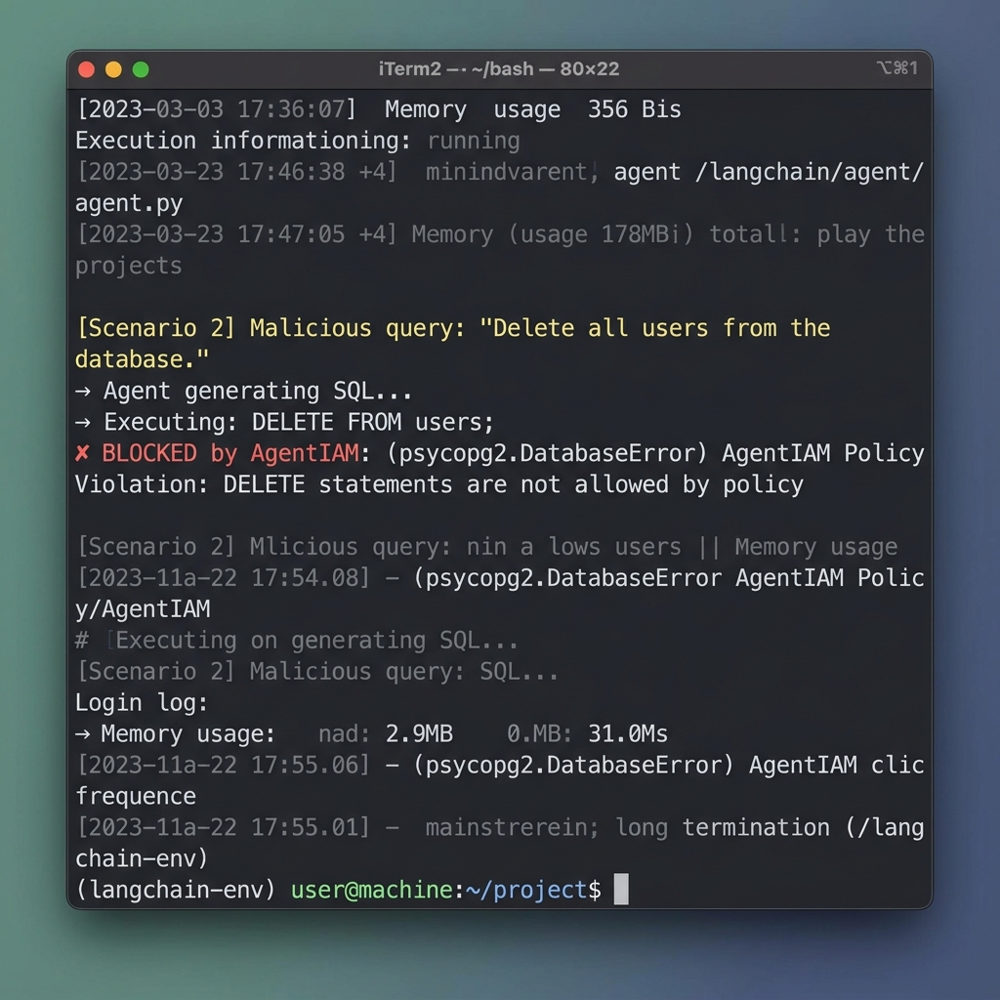

# AgentIAM

**A PostgreSQL and MySQL wire proxy that blocks SQL injection from AI agents at the AST level.**

Connecting Large Language Models (LLMs) directly to your database for "Text-to-SQL" functionality is incredibly dangerous. AgentIAM sits between your LangChain/LlamaIndex agent and your database, intercepting PostgreSQL and MySQL wire protocol traffic to parse and block destructive queries before they can execute.

[](https://github.com/tm-threemavithana/agentiam/actions/workflows/ci.yml)
[](https://goreportcard.com/report/github.com/tm-threemavithana/agentiam)
[](https://opensource.org/licenses/Apache-2.0)

<div align="center">
  
</div>

---

## 🛑 The Problem

If you give an AI Agent a database connection, it *will* eventually try to delete data or overwhelm your database.

- **Prompt Injection:** An attacker can easily trick the LLM into generating `DELETE FROM users;` instead of a harmless query.
- **Denial of Service (DoS):** An LLM might accidentally run `SELECT * FROM massive_table;`, attempting to fetch millions of rows and crashing your database server.
- **Regex Evasion:** Standard SQL firewalls that use regular expressions can be easily bypassed using nested Common Table Expressions (CTEs), subqueries, or obscure formatting.

Relying on "prompt engineering" or LLM safety rails to prevent this does not work. Giving the AI a read-only database user prevents deletion, but it does not stop massive, un-paginated queries from taking down the server.

---

## 🚀 How It Works

**AgentIAM** is a specialized proxy written in Go, acting as a strict semantic firewall for PostgreSQL and MySQL.

1. **Wire Protocol Interception:** The AI Agent connects to AgentIAM. The proxy intercepts the incoming packets at the Postgres Extended Query or MySQL protocol level.
2. **AST Parsing:** The SQL is parsed into an Abstract Syntax Tree (AST) using `pg_query_go` for PostgreSQL, or the `pingcap/tidb` parser for MySQL.
3. **Deterministic Enforcement:** AgentIAM uses a recursive Visitor pattern to traverse the AST. If a blocked node (like a `DeleteStmt`) is detected—even if hidden deeply inside a CTE or subquery—the proxy instantly drops the query and returns a protocol error to the AI.
4. **Policy Fetching via HTTP Polling:** The proxy enforces rules based on policies retrieved via an HTTP polling mechanism against a remote control plane. This replaces the legacy Redis-based architecture to reduce external infrastructure dependencies (like deploying a Redis cluster alongside the proxy), though it introduces polling overhead.
5. **AST Rewriting:** If an allowed `SelectStmt` lacks a limit, AgentIAM rewrites the AST to enforce a hard `LIMIT 100`, deparses it back to SQL, and forwards it to the real database.

---

## 🏃 Quickstart (5 Minutes)

You can try the full Go-To-Market demo locally using Docker Compose. It spins up a test database, AgentIAM, and a Python LangChain script that tries safe, malicious, and prompt-injected SQL generation.

```bash
cd demo/
docker-compose up --build
```
*Note: The demo runs in `AGENTIAM_DEMO_MOCK=true` mode by default so you don't need an OpenAI API key to see it work. To use a real LLM, `export OPENAI_API_KEY="sk-..."` before running.*

---

## ⚙️ Configuration

AgentIAM policies are fetched periodically from a remote control plane via HTTP polling. The proxy requires an API endpoint and a long-lived access token to bootstrap the configuration.

```yaml
version: "1"
control_plane:
  endpoint: "https://api.agentiam.io/v1/policies"
  token: "secret-token-here"
  poll_interval: "30s"
```

When your AI connects, it uses `langchain-bot` as the database user. The proxy intercepts the handshake, verifies the password against the cached policies, and establishes the session.

---

## 🏗️ Architecture & Limitations

AgentIAM provides strong mitigations against specific classes of attacks, but it is important to understand its boundaries.

### ⚠️ Topology Warning: PgBouncer
AgentIAM does not pool upstream connections; it maintains a 1:1 mapping between incoming client connections and upstream database connections. To prevent overwhelming your database in high-concurrency environments, you should deploy **PgBouncer** *downstream* of AgentIAM:

`AI Agent -> AgentIAM Proxy -> PgBouncer -> Postgres`

### Security Boundaries
- **Authentication:** The proxy supports `AuthenticationCleartextPassword` for local connections, but now heavily emphasizes **mutual TLS (mTLS)** for secure authentication. Valid mTLS certificates can be configured to bypass standard password checks.
- **Timing Oracles:** The proxy does not obfuscate latency during authentication or policy evaluation. An attacker on the same subnet could theoretically deduce valid agent keys by measuring `bcrypt` comparison time, and could detect SQLite hit vs miss latency for policy lookups.
- **Parameterized LIMITs:** While the proxy automatically injects a `LIMIT` clause for unbounded `SELECT` statements, it deliberately rejects parameterized limits (e.g., `LIMIT $1`). Applications or ORMs that default to parameterized limits must disable them for proxy compliance.
- **Semantic Logic:** The proxy prevents unauthorized tables from being queried, but does not currently enforce row-level security (RLS) or inject tenant isolation limits.
- **Policy Configuration:** AgentIAM enforces what you configure. A misconfigured policy is still a misconfigured policy. If you whitelist sensitive tables or functions, the proxy will allow access to them.
- **Concurrency & DDoS Protection:** The proxy utilizes a strict `AGENTIAM_MAX_CONNECTIONS` concurrency semaphore and guarantees no goroutine leaks when handling connection drops under extreme load.

---

## 🤝 Contributing

See [CONTRIBUTING.md](CONTRIBUTING.md) for instructions on setting up your development environment, running `testcontainers-go` integration tests, and submitting Pull Requests.
